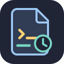

# omp-persist-system-prompt plugin

This package provides an Oh My Pi (OMP) extension that records distinct effective system prompts and selected provider tool context in hidden session metadata for transcript indexing. It is loaded through the OMP extension entry in `package.json`; the Claude plugin manifest does not register a Claude hook or skill, so installing that manifest alone does not execute the OMP extension in Claude Code.

## What it records

At `agent_start`, the extension marks the prompt for capture. On the following `before_provider_request`, it snapshots the current system-prompt string array and, when present, JSON values from these provider payload keys: `instructions`, `system`, `systemInstruction`, `system_instruction`, `tools`, `toolConfig`, and `tool_config`. It appends an `omp-system-prompt` custom entry through the session manager, avoids duplicate identical prompt/context snapshots, and resets its in-memory cache on session start, switch, or branch. It does not capture provider message arrays or conversation input.

## Data handling

The snapshot is stored in the active OMP session branch, not sent by this extension to a separate service. Prompt or tool descriptions can still contain project-specific or sensitive text; hidden metadata is not a secrecy boundary. The OMP host and configured model provider handle their ordinary inference requests separately. See [PRIVACY.md](PRIVACY.md).

- [Documentation](https://go.vza.net/agent-plugins/omp-persist-system-prompt/docs)
- [Support](https://go.vza.net/agent-plugins/omp-persist-system-prompt/support)
- [Privacy policy](https://go.vza.net/agent-plugins/omp-persist-system-prompt/privacy)
