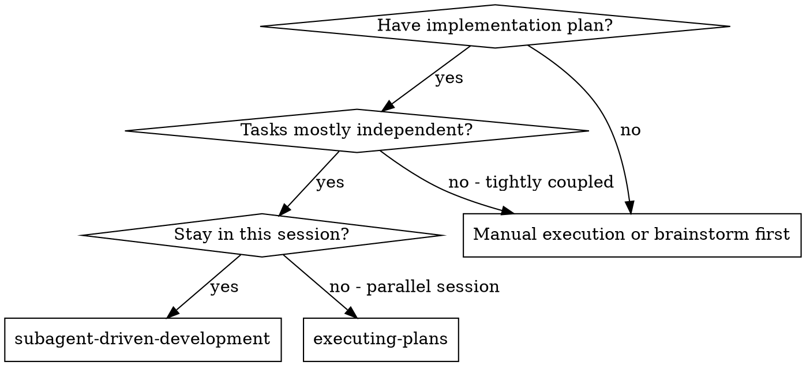
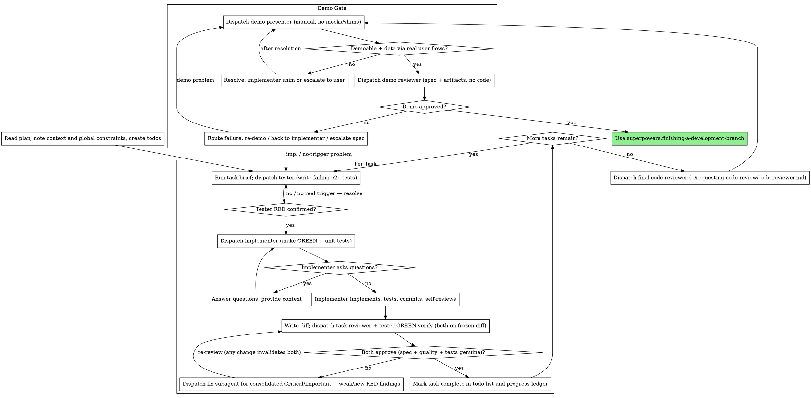

# Subagent-Driven Development

Execute the plan by dispatching a fresh subagent per role per task: a tester
writes failing e2e/integration tests, an implementer makes them GREEN plus its
own unit tests, a task review (spec compliance + code quality) and a tester
GREEN-verification gate each task, a broad whole-branch review at the end, and
a demo gate (present + review) before the branch ships.

**Why subagents:** You delegate to specialized agents with isolated context. By
precisely crafting their instructions and context, you keep them focused and
successful. They never inherit your session's context or history — you construct
exactly what each one needs. This also preserves your own context for
coordination work.

**Core principle:** Fresh subagent per role per task + adversarial tester
(independent RED tests, GREEN re-verified) + task review (spec + quality) +
broad final review + demo gate = high quality that structurally cannot be faked.
Nobody grades their own work: the implementer does not author the e2e tests, and
the demo reviewer never sees the code.

**Narration:** between tool calls, narrate at most one short line — the ledger
and the tool results carry the record.

**Continuous execution:** Do not pause to check in with your human partner
between tasks. Execute all tasks from the plan without stopping. The only
reasons to stop are: a BLOCKED status you cannot resolve, ambiguity that
genuinely prevents progress, a demo/spec gate that needs a human decision, or
all tasks complete. "Should I continue?" prompts and progress summaries waste
their time — they asked you to execute the plan, so execute it.

## When to Use



**vs. Executing Plans (parallel session):**
- Same session (no context switch)
- Fresh subagent per role per task (no context pollution)
- Independent tester per task, review after each, broad review + demo gate at the end
- Faster iteration (no human-in-loop between tasks)

## Roles

Each role is a fresh subagent dispatched with exactly the context it needs — no
persistent team, no shared history. The implementer and every reviewer are
separate agents so no one grades their own work.

| Role | subagent_type | Purpose | Prompt |
|------|---------------|---------|--------|
| **implementer** | `general-purpose` | Makes the tester's e2e tests GREEN, writes unit tests, commits, self-reviews | [implementer-prompt.md](implementer-prompt.md) |
| **tester** | `general-purpose` | Writes adversarial e2e/integration RED tests before impl; re-verifies GREEN is genuine | [tester-prompt.md](tester-prompt.md) |
| **task reviewer** | `general-purpose` | One task's spec compliance + code quality from the diff | [task-reviewer-prompt.md](task-reviewer-prompt.md) |
| **demo presenter** | `general-purpose` | Demos the finished feature manually as a real user; no mocks/shims | [demo-presenter-prompt.md](demo-presenter-prompt.md) |
| **demo reviewer** | `general-purpose` | Judges the demo as a strict client CEO; spec + demo artifacts only, no code | [demo-reviewer-prompt.md](demo-reviewer-prompt.md) |

## The Process



## Pre-Flight Plan Review

Before dispatching Task 1, scan the plan once for conflicts:

- tasks that contradict each other or the plan's Global Constraints
- anything the plan explicitly mandates that the review rubric treats as a
  defect (a test that asserts nothing, verbatim duplication of a logic block)

Present everything you find to your human partner as one batched question —
each finding beside the plan text that mandates it, asking which governs —
before execution begins, not one interrupt per discovery mid-plan. If the
scan is clean, proceed without comment. The review loop remains the net for
conflicts that only emerge from implementation.

## Per-Task Cycle

Record the current HEAD as this task's BASE before dispatching anything. The
task moves through four dispatches; every artifact is a file, never pasted
prose (see File Handoffs).

1. **Tester writes failing tests (RED).** Run `scripts/task-brief PLAN N`, then
   dispatch the tester ([tester-prompt.md](tester-prompt.md), Mode 1) with the
   brief and the global constraints. It writes e2e/integration tests grounded
   only in the spec and public APIs, confirms RED, commits them, and reports
   the test paths. If the tester can only trigger the behavior through a
   test-only backdoor — a forced-state flag, a `window.*` hook — that is a
   likely missing production trigger: resolve it before implementing, do not
   let it paper over the gap.
2. **Implementer makes it GREEN.** Dispatch the implementer
   ([implementer-prompt.md](implementer-prompt.md)) with the brief, the tester's
   test paths, and context. It confirms RED, implements, writes its own unit
   tests, makes everything GREEN, commits, self-reviews, and writes its report
   file. Handle its status per Handling Implementer Status.
3. **Task review + GREEN verification (together, on the frozen diff).** Run
   `scripts/review-package BASE HEAD`, then dispatch both — they operate on the
   same frozen diff, so run them together (the tester may add new failing tests;
   the task reviewer is read-only):
   - the **task reviewer** ([task-reviewer-prompt.md](task-reviewer-prompt.md))
     — spec compliance + code quality;
   - the **tester** ([tester-prompt.md](tester-prompt.md), Mode 2) — re-runs its
     tests, checks no assertion was weakened or deleted in the diff, judges test
     strength, and if the implementer passed everything first try, adds harder
     adversarial tests (new RED).
4. **Adjudicate and fix.** The task is done only when the task reviewer returns
   spec compliant + quality Approved AND the tester returns GREEN_VERIFIED.
   Anything else — Critical/Important findings, WEAK_TESTS, NEW_RED,
   NO_REAL_TRIGGER — goes to a single fix subagent as one consolidated list.
   **Any implementation change invalidates both verdicts:** regenerate the
   review package and re-dispatch both. Resolve the task reviewer's ⚠️ items
   yourself (Handling Reviewer ⚠️ Items). Mark complete in the ledger and todos
   only when all of this is clean.

**Safety valve:** cap at 3 full review cycles per task. If after 3 either gate
is still unsatisfied, escalate to your human partner.

## Model Selection

Use the least powerful model that can handle each role to conserve cost and increase speed.

**Mechanical implementation tasks** (isolated functions, clear specs, 1-2 files): use a fast, cheap model. Most implementation tasks are mechanical when the plan is well-specified.

**Integration and judgment tasks** (multi-file coordination, pattern matching, debugging): use a standard model.

**Architecture and design tasks**: use the most capable available model.
The final whole-branch review is one of these — dispatch it on the most
capable available model, not the session default.

**Review, tester, and demo tasks**: choose the model with the same judgment,
scaled to the diff's size, complexity, and risk. A small mechanical diff does
not need the most capable model; a subtle concurrency change does. Adversarial
test authoring and demo judgment are judgment work — use a mid-tier model as
the floor, never the cheapest tier.

**Always specify the model explicitly when dispatching a subagent.** An
omitted model inherits your session's model — often the most capable and
most expensive — which silently defeats this section.

**Turn count beats token price.** Wall-clock and context cost scale with how
many turns a subagent takes, and the cheapest models routinely take 2-3× the
turns on multi-step work — costing more overall. Use a mid-tier model as the
floor for reviewers and for implementers working from prose descriptions.
When the task's plan text contains the complete code to write, the
implementation is transcription plus testing: use the cheapest tier for
that implementer. Single-file mechanical fixes also take the cheapest tier.

**Task complexity signals (implementation tasks):**
- Touches 1-2 files with a complete spec → cheap model
- Touches multiple files with integration concerns → standard model
- Requires design judgment or broad codebase understanding → most capable model

## Handling Implementer Status

Implementer subagents report one of four statuses. Handle each appropriately:

**DONE:** Generate the review package (`scripts/review-package BASE HEAD`, from this skill's directory — it prints the unique file path it wrote; BASE is the commit you recorded before dispatching the implementer — never `HEAD~1`, which silently drops all but the last commit of a multi-commit task), then dispatch the task reviewer and the tester GREEN-verify with the printed path.

**DONE_WITH_CONCERNS:** The implementer completed the work but flagged doubts. Read the concerns before proceeding. If the concerns are about correctness or scope, address them before review. If they're observations (e.g., "this file is getting large"), note them and proceed to review. A reported spec bug is a concern — decide whether to escalate to your human partner or authorize a spec patch before continuing.

**NEEDS_CONTEXT:** The implementer needs information that wasn't provided. Provide the missing context and re-dispatch.

**BLOCKED:** The implementer cannot complete the task. Assess the blocker:
1. If it's a context problem, provide more context and re-dispatch with the same model
2. If the task requires more reasoning, re-dispatch with a more capable model
3. If the task is too large, break it into smaller pieces
4. If the plan itself is wrong, escalate to the human

**Never** ignore an escalation or force the same model to retry without changes. If the implementer said it's stuck, something needs to change.

## Handling Reviewer ⚠️ Items

The task reviewer may report "⚠️ Cannot verify from diff" items — requirements
that live in unchanged code or span tasks. These do not block the rest of the
review, but you must resolve each one yourself before marking the task
complete: you hold the plan and cross-task context the reviewer
lacks. If you confirm an item is a real gap, treat it as a failed spec
review — send it back to the implementer and re-review.

## Constructing Reviewer Prompts

Per-task reviews are task-scoped gates. The broad review happens once, at the
final whole-branch review. When you fill a reviewer template:

- Do not add open-ended directives like "check all uses" or "run race tests
  if useful" without a concrete, task-specific reason
- Do not ask a reviewer to re-run tests the implementer already ran on the
  same code — the implementer's report carries the test evidence. (The tester
  GREEN-verify is the deliberate exception: its whole job is to distrust the
  implementer's pass claim and re-run its own e2e tests.)
- Do not pre-judge findings for the reviewer — never instruct a reviewer to
  ignore or not flag a specific issue. If you believe a finding would be a
  false positive, let the reviewer raise it and adjudicate it in the review
  loop. If the prompt you are writing contains "do not flag," "don't treat X
  as a defect," "at most Minor," or "the plan chose" — stop: you are
  pre-judging, usually to spare yourself a review loop.
- The global-constraints block you hand the reviewer is its attention
  lens. Copy the binding requirements verbatim from the plan's Global
  Constraints section or the spec: exact values, exact formats, and the
  stated relationships between components ("same layout as X", "matches
  Y"). The reviewer's template already carries the process rules (YAGNI,
  test hygiene, review method) — the constraints block is for what THIS
  project's spec demands.
- Hand the reviewer its diff as a file: run this skill's
  `scripts/review-package BASE HEAD` and pass the reviewer the file path
  it prints (or, without bash: `git log --oneline`, `git diff --stat`,
  and `git diff -U10` for the range, redirected to one uniquely named
  file). The output never enters your own context, and the reviewer sees
  the commit list, stat summary, and full diff with context in one Read
  call. Use the BASE you recorded before dispatching the implementer —
  never `HEAD~1`, which silently truncates multi-commit tasks.
- A dispatch prompt describes one task, not the session's history. Do not
  paste accumulated prior-task summaries ("state after Tasks 1-3") into
  later dispatches — a real session's dispatch hit 42k chars of which 99%
  was pasted history. A fresh subagent needs its task, the interfaces it
  touches, and the global constraints. Nothing else.
- Dispatch fix subagents for Critical and Important findings. Record Minor
  findings in the progress ledger as you go, and point the final
  whole-branch review at that list so it can triage which must be fixed
  before merge. A roll-up nobody reads is a silent discard.
- A finding labeled plan-mandated — or any finding that conflicts with
  what the plan's text requires — is the human's decision, like any plan
  contradiction: present the finding and the plan text, ask which governs.
  Do not dismiss the finding because the plan mandates it, and do not
  dispatch a fix that contradicts the plan without asking.
- The final whole-branch review gets a package too: run
  `scripts/review-package MERGE_BASE HEAD` (MERGE_BASE = the commit the
  branch started from, e.g. `git merge-base main HEAD`) and include the
  printed path in the final review dispatch, so the final reviewer reads
  one file instead of re-deriving the branch diff with git commands.
- Every fix dispatch carries the implementer contract: the fix subagent
  re-runs the tests covering its change and reports the results. Name the
  covering test files in the dispatch — a one-line fix does not need the
  whole suite. Before re-dispatching the reviewer, confirm the fix report
  contains the covering tests, the command run, and the output; dispatch
  the re-review once all three are present.
- If the final whole-branch review returns findings, dispatch ONE fix
  subagent with the complete findings list — not one fixer per finding.
  Per-finding fixers each rebuild context and re-run suites; a real
  session's final-review fix wave cost more than all its tasks combined.

## Demo Gate

After the final whole-branch review is clean, the feature passes one last gate
that no test suite can fake: a human-style demo. It is the backstop that
catches a feature the tests only reached through a backdoor.

- **Present.** Dispatch the demo presenter
  ([demo-presenter-prompt.md](demo-presenter-prompt.md)) with the spec and the
  completed-task list (the ledger). It drives the finished feature manually as
  a real user — no test scripts, no mocks, no route interception, no seed
  shims — creating all demo data through real user flows, records step-by-step
  artifacts under `spec/demo/…`, commits them, and reports.
- **Resolve demoability yourself.** The presenter never builds infrastructure.
  If it reports `DEMO_DATA_BLOCKED` (cannot create data through user flows),
  `UNDEMOABLE` (no user-facing surface), or `NEEDS_DEMO_PLAN`, you decide: have
  the implementer build a testing shim (a lightweight temporary feature kept
  until the real one lands), pull UI forward, record a demo plan into the spec,
  or escalate to your human partner. Then re-dispatch the presenter.
- **Review.** Dispatch the demo reviewer
  ([demo-reviewer-prompt.md](demo-reviewer-prompt.md)) with the spec and the
  artifacts directory only — never the code. It judges as a strict client CEO:
  every spec requirement not shown working is not delivered.
- **Route rejection.** A demo problem (sloppy/incomplete walkthrough) → re-demo.
  An implementation problem, or a presenter "no user-reachable trigger" report
  → back to the implementer, re-entering the per-task cycle (fresh tester +
  implementer) for the affected area, then re-demo and re-review from scratch.
  A spec problem → escalate to your human partner, then re-enter the affected
  tasks. **Any implementation change after a demo invalidates it — always
  re-demo and re-review from scratch.**

Only after the demo reviewer approves do you run
`superpowers:finishing-a-development-branch`.

## File Handoffs

Everything you paste into a dispatch prompt — and everything a subagent
prints back — stays resident in your context for the rest of the session
and is re-read on every later turn. Hand artifacts over as files:

- **Task brief:** before dispatching the tester or implementer, run this
  skill's `scripts/task-brief PLAN_FILE N` — it extracts the task's full text
  to a uniquely named file and prints the path. Both the tester and the
  implementer read the same brief; it is the single source of requirements.
  Your dispatch should contain: (1) one line on where this task fits in the
  project; (2) the brief path, introduced as "read this first — it is your
  requirements, with the exact values to use verbatim"; (3) interfaces and
  decisions from earlier tasks that the brief cannot know; (4) your resolution
  of any ambiguity you noticed in the brief; (5) the report-file path and
  report contract. Exact values (numbers, magic strings, signatures, test
  cases) appear only in the brief.
- **Report files:** name each subagent's report after the brief (brief
  `…/task-N-brief.md` → implementer report `…/task-N-report.md`, tester report
  `…/task-N-tester-report.md`, GREEN-verify `…/task-N-verify.md`). The subagent
  writes the full report there and returns only status, commits/paths, a
  one-line summary, and concerns.
- **Reviewer inputs:** the task reviewer gets the brief, the implementer's
  report, and the review package, plus the global constraints that bind the
  task. The tester GREEN-verify gets its own RED report, its test file paths,
  the implementer's report, and the review package.
- **Demo inputs:** the presenter gets the spec file and the completed-task
  list (the ledger); the demo reviewer gets the spec file and the artifacts
  directory the presenter wrote and committed. Neither is pasted inline.
- Fix dispatches append their fix report (with test results) to the same
  report file and return a short summary; re-reviews read the updated file.

## Durable Progress

Conversation memory does not survive compaction. In real sessions,
controllers that lost their place have re-dispatched entire completed task
sequences — the single most expensive failure observed. Track progress in
a ledger file, not only in todos.

- At skill start, check for a ledger:
  `cat "$(git rev-parse --show-toplevel)/.superpowers/sdd/progress.md"`. Tasks listed there
  as complete are DONE — do not re-dispatch them; resume at the first task
  not marked complete.
- When a task's review comes back clean, append one line to the ledger in
  the same message as your other bookkeeping:
  `Task N: complete (commits <base7>..<head7>, review clean, GREEN verified)`.
- The ledger is your recovery map: the commits it names exist in git even
  when your context no longer remembers creating them. After compaction,
  trust the ledger and `git log` over your own recollection.
- `git clean -fdx` will destroy the ledger (it's git-ignored scratch); if
  that happens, recover from `git log`.

## Prompt Templates

- [tester-prompt.md](tester-prompt.md) - Dispatch tester subagent (Mode 1: write failing e2e tests; Mode 2: verify GREEN)
- [implementer-prompt.md](implementer-prompt.md) - Dispatch implementer subagent
- [task-reviewer-prompt.md](task-reviewer-prompt.md) - Dispatch task reviewer subagent (spec compliance + code quality)
- [demo-presenter-prompt.md](demo-presenter-prompt.md) - Dispatch demo presenter subagent
- [demo-reviewer-prompt.md](demo-reviewer-prompt.md) - Dispatch demo reviewer subagent
- Final whole-branch review: use superpowers:requesting-code-review's [code-reviewer.md](../requesting-code-review/code-reviewer.md)

## Example Workflow

```
You: I'm using Subagent-Driven Development to execute this plan.

[Read plan file once: docs/superpowers/plans/feature-plan.md]
[Create todos for all tasks]

Task 1: User registration form

[Record BASE = HEAD]
[Run task-brief for Task 1]
[Dispatch tester (Mode 1) with brief + global constraints]
Tester: DONE (RED). tests/e2e/test_registration.py — happy path, duplicate
  email, weak password, empty fields. 4/4 FAIL. Committed. report path: …

[Dispatch implementer with brief + tester's test paths + context]
Implementer: DONE. Registration form + validation + persistence. Tester's 4
  e2e GREEN, 6 unit tests GREEN, output pristine. Committed. report path: …

[Run review-package BASE HEAD]
[Dispatch task reviewer + tester GREEN-verify together on the diff]
Task reviewer: Spec compliant. Quality: Important — password validation
  duplicated in frontend and backend; extract shared validation. Else Approved.
Tester (verify): assertions intact, but implementer passed first try, so added
  test_registration_sql_injection + test_registration_xss_in_name. Both FAIL
  (NEW_RED).

[Dispatch ONE fix subagent: extract shared validation + make SQLi/XSS tests GREEN]
Fixer: Extracted validation module, added input sanitization. All 8 e2e + 6
  unit GREEN. Committed.

[Regenerate review-package; re-dispatch both]
Task reviewer: Spec compliant. Quality approved — duplication resolved.
Tester (verify): GREEN_VERIFIED. Assertions intact, adversarial cases covered.

[Mark Task 1 complete in ledger]

Task 2: Login flow  [similar cycle]
Task 3: Password reset  [similar cycle]

[After all tasks — final whole-branch review]
[Run review-package MERGE_BASE HEAD; dispatch final code-reviewer, most capable model]
Final reviewer: Consistent patterns, good coverage, ready to merge.

[Demo gate]
[Dispatch demo presenter with spec + ledger]
Demo presenter: DONE. Devised demo plan (register → logout → login → reset →
  login with new password → duplicate-email error). Drove it via Playwright as
  a real user, screenshots in spec/demo/auth-system/. Committed. Observation:
  reset email link takes ~3s to appear.

[Dispatch demo reviewer with spec + artifacts dir (no code)]
Demo reviewer: REJECTED. Password-reset demo clicks the link but never shows
  the 'set new password' form the spec requires; no login error cases shown.
  Root cause: demo problem (incomplete walkthrough).

[Re-dispatch demo presenter: show full reset form + login error cases]
Demo presenter: DONE. Updated artifacts.

[Re-dispatch demo reviewer with updated artifacts]
Demo reviewer: APPROVED. All requirements demonstrated.

[Use superpowers:finishing-a-development-branch]

Done!
```

## Advantages

**vs. Manual execution:**
- Subagents follow TDD naturally; an independent tester authors the e2e tests
- Fresh context per role per task (no confusion)
- Parallel-safe (subagents don't interfere)
- Subagent can ask questions (before AND during work)

**vs. Executing Plans:**
- Same session (no handoff)
- Continuous progress (no waiting)
- Review, tester, and demo checkpoints automatic

**Efficiency gains:**
- Controller curates exactly what context is needed; bulk artifacts move
  as files, not pasted text
- Subagent gets complete information upfront
- Questions surfaced before work begins (not after)

**Quality gates:**
- Independent tester authors e2e tests, so the implementer cannot grade its own tests
- Tester re-verifies GREEN — weakened assertions and first-try passes get caught
- Task review carries two verdicts: spec compliance and code quality
- Review loops ensure fixes actually work
- Spec compliance prevents over/under-building; code quality ensures it is well-built
- The demo gate uses only real user inputs, so a feature reachable only through
  a backdoor cannot pass

**Cost:**
- More subagent invocations (tester + implementer + reviewers per task, plus demo)
- Controller does more prep work (extracting all tasks upfront)
- Review loops add iterations
- But catches issues early (cheaper than debugging later)

## Red Flags

**Never:**
- Start implementation on main/master branch without explicit user consent
- Implement, or write the e2e tests, yourself — dispatch subagents for both
- Let the implementer author the e2e/integration tests (that is the tester's job — unit tests are the implementer's)
- Skip task review, or accept a report missing either verdict (spec compliance AND task quality are both required)
- Skip the tester GREEN-verify (the implementer may have weakened assertions or passed a too-weak suite)
- If the implementer passes all tests first try, accept without the tester strengthening them
- Proceed with unfixed issues
- Dispatch multiple implementation subagents in parallel (conflicts) — reviewers and the tester GREEN-verify are read-only and may run together
- Make a subagent read the whole plan file (hand it its task brief — `scripts/task-brief` — instead)
- Skip scene-setting context (subagent needs to understand where task fits)
- Ignore subagent questions (answer before letting them proceed)
- Accept "close enough" on spec compliance (reviewer found spec issues = not done)
- Skip review loops (reviewer found issues = fix subagent fixes = review again)
- Let a test trigger the path under test through a test-only backdoor (a forced-state flag like `connected:true`, a `window.*` hook) instead of a real user action or real adapter event — the backdoor is itself evidence the production trigger may be missing
- Accept tests that all run against one default fixture when the feature behaves differently across states (connected/disconnected, alternate modes/units, empty/populated) — silent no-ops hide in the non-default states
- Tell a reviewer what not to flag, or pre-rate a finding's severity in the dispatch prompt ("treat it as Minor at most")
- Dispatch a task reviewer without a diff file — generate it first (`scripts/review-package BASE HEAD`) and name the printed path in the prompt
- **Any implementation change invalidates BOTH task verdicts** — re-run task review and tester GREEN-verify
- Skip the demo gate — it is the one gate that structurally cannot cheat (only real inputs, no hooks or forced state), so it is the backstop that catches features tests reached through a backdoor
- Let the demo presenter use automated test scripts, mocks, route interception, request stubs, or testability shims — real user emulation only; shims go through you to the implementer
- Let the demo presenter create demo data through anything other than real user flows (UI, documented CLI, public APIs) — if it can't, it escalates to you
- Give the demo reviewer access to implementation code
- Accept "feature can't be demoed" without investigating — this is a design smell
- **Any implementation change after a demo invalidates the demo** — re-demo and re-review from scratch
- Move to the next task while either task gate has open issues
- Re-dispatch a task the progress ledger already marks complete — check the ledger (and `git log`) after any compaction or resume

**If subagent asks questions:**
- Answer clearly and completely
- Provide additional context if needed
- Don't rush them into implementation

**If a reviewer or the tester finds issues:**
- Consolidate all findings into one fix dispatch to a fix subagent
- Confirm the fix report carries the covering tests, command, and output
- Re-run BOTH task gates (implementation changed)
- Repeat until both approve

**If subagent fails task:**
- Dispatch fix subagent with specific instructions
- Don't try to fix manually (context pollution)

**If the demo reviewer rejects:**
- Classify: demo problem, implementation problem, or spec problem
- Route to a re-demo, back to the implementer (re-enter the task cycle), or escalate the spec
- After any implementation fix: re-demo and re-review from scratch

## Integration

**Required workflow skills:**
- **superpowers:using-git-worktrees** - Ensures isolated workspace (creates one or verifies existing)
- **superpowers:writing-plans** - Creates the plan this skill executes
- **superpowers:requesting-code-review** - Code review template for the final whole-branch review
- **superpowers:finishing-a-development-branch** - Complete development after all tasks and the demo gate pass

**Subagents should use:**
- **superpowers:test-driven-development** - The tester and implementer follow TDD for each task

**Alternative workflow:**
- **superpowers:executing-plans** - Use for parallel session instead of same-session execution
```
